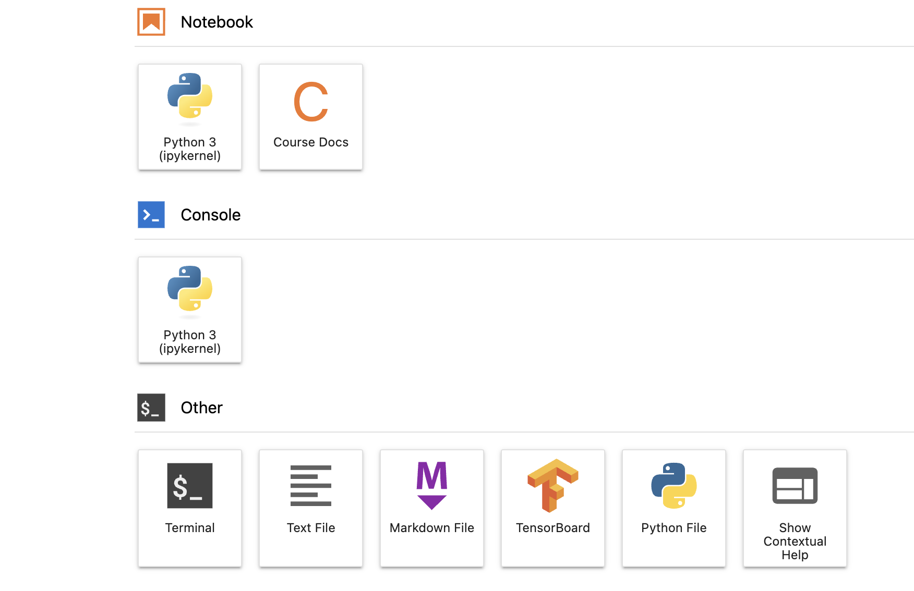
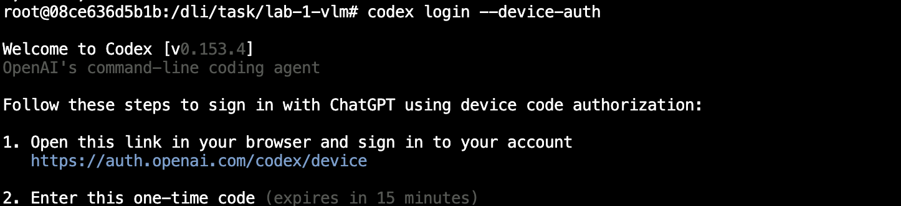

# Part 2.1: Deploy Zero-Shot VSS for Alert Verification

VSS Alert Verification is a three-stage pipeline. RT-CV detects and tracks vehicles, Behavior Analytics turns tracks into candidate alerts (stopped vehicle, collision), and Alert Bridge sends each candidate clip to Cosmos Reason 3 Nano, which confirms or rejects it.

In this walkthrough you deploy that pipeline with a coding agent and the VSS agent skills, using the traffic-tuned profile and the stock, zero-shot Cosmos Reason 3 Nano. You then run one evaluation video through it and read the verdicts. Collisions get confirmed. Stalled vehicles do not. That gap is what the rest of Part 2 closes.

```{nvlearning-meta}
- **Level:** All levels — no prior VLM or Cosmos experience needed
- **Duration:** About 20 minutes. One deployment wait of about 4 minutes, one evaluation video of about 6 minutes.
- **Agent:** Codex with the VSS skills
- **Working directory:** `/opt/vss`
```

## Learning Objectives

```{nvlearning-objectives}
- **Set up** the coding agent, install the VSS skills, and give the agent the environment context it needs.
- **Deploy** the traffic-tuned VSS profile with the stock Cosmos Reason 3 Nano from pre-seeded caches.
- **Explain** what each deployed component does while the stack comes up.
- **Run** an evaluation video and read the candidates, the Cosmos verdicts and the reasoning field in the UI.
- **Recognise** the zero-shot gap on stalled vehicles that Parts 2.2 to 2.4 close.
```

## What You Are Deploying

Nineteen services on two GPUs. Video enters through VIOS, the video store, which turns an uploaded MP4 into a stream and later cuts the evidence clips. RT-CV, a prebuilt vision microservice from VSS running on GPU 0, performs GPU-optimized detection and tracking: it runs the TrafficCamNet RT-DETR detector and tracks every vehicle. Behavior Analytics applies two rules to those tracks, stopped vehicle and collision, and raises a candidate alert for each. Alert Bridge cuts a clip per candidate and asks Cosmos Reason 3 Nano, served by RT-VLM on GPU 1, one fixed question: which of the following does this clip show, a collision, a stalled vehicle, or neither, answered as exactly one label. The verdict and its reasoning land in Elasticsearch, and the UI at `/alerts/` reads them from there. Kafka carries events between stages, Postgres holds the video catalogue, and all of that state lives in named volumes that survive every shutdown. HAProxy on port 80 is the only way in; DLI publishes nothing else.


## Step 1: Check the Box, Log In, Set the Environment, Start the Agent

Open a terminal in JupyterLab: on the Launcher, under Other, click Terminal.



First make sure nothing from the morning labs is still running: the deployment needs both GPUs.

```bash
docker ps
nvidia-smi --query-gpu=index,memory.used,memory.total --format=csv
```

Expected: no containers, both GPUs under 1 GB used. If a container from Lab 1, 2 or 3 is still listed (Lab 1's is `cosmos3-reasoner`), remove it with `docker rm -f <name>` and check again before continuing.

Log the agent in. The device flow prints a URL and a code. Open the URL in your browser, sign in, and enter the code.

```bash
codex login --device-auth
```



Now set the environment for the deployment. Replace `<your-lab-host>` with the hostname from your browser's address bar: keep only the hostname, no `https://`, no `/lab/lab`, nothing after it. The NGC key is typed silently and lives only in this shell. Everything the agent needs is exported before it starts, because Codex inherits its environment at launch.

```bash
export AICITY_PUBLIC_URL="http://<your-lab-host>"
export AICITY_MEDIA_DIR=/dli/task/data
export AICITY_DATA_DIR=/opt/aicity-runtime/aicity-vss-data
export AICITY_BUILD_DIR=/opt/vss/_builds/aicity-track4-alert-verification-dli-cvfix4
export NGC_CLI_ORG=nvidia
read -rsp 'NGC Personal Key: ' NGC_CLI_API_KEY && echo && export NGC_CLI_API_KEY NGC_API_KEY="$NGC_CLI_API_KEY"
printf '%s\n' "$NGC_CLI_API_KEY" | docker login nvcr.io --username '$oauthtoken' --password-stdin
cd /opt/vss && codex --dangerously-bypass-approvals-and-sandbox
```

The last flag lets Codex run commands without asking for approval on each one. A deployment is dozens of commands, and this lab container is already the sandbox: it is disposable, it holds no credentials beyond the key you just typed, and the only thing it can reach is the inner Docker daemon. Codex still explains every step; you read instead of clicking.

Once Codex opens, type `/model` and choose **GPT 5.6 Sol** with **Medium** reasoning. Other models were not tested against these skills.

Keep this terminal open for the rest of Part 2. Part 2.4 reuses this shell and this Codex session.

Never paste the key into Codex, a notebook cell, or a file. If the agent ever asks for it, the answer is that the key is already exported in the shell.

## Step 2: Install the Skills

Paste into Codex:

```
Read /opt/vss/skills/README.md and install those skills for this host so I can invoke them from a shell or chat session.
```

Expected: Codex reads the README, links the 16 VSS skills into its skills directory and lists them. About a minute.

## Step 3: Give the Agent the Environment Context

Paste this as one message, on its own, before anything else. Wait for Codex to reply that it understands before you continue. It is the difference between a deployment that works and an hour of debugging the wrong namespace.

```
Context before you begin. This is a Docker-in-Docker environment, so several things differ from a workstation:

1. The Docker daemon is NOT local. It is remote, reached via DOCKER_HOST, and is already configured for VSS. Verify it with `docker info` rather than reading /etc/docker/daemon.json or running sysctl locally - those describe this container, not the daemon. There is no sudo here and none is needed.

2. HOST_IP in this shell is the daemon's own address and is what the AI City build.py takes as --host-ip. Do NOT derive an address from this container's own interfaces or routes (`ip route get`, `hostname -I`). If you ever need to re-detect it, the correct value is:

   docker run --rm --network host busybox:1.37.0 \
     ip -4 addr show eth0 | awk '/inet /{print $2}' | cut -d/ -f1

   (equivalently: getent hosts dind). It changes whenever the daemon container is recreated.

3. The browser hostname travels in AICITY_PUBLIC_URL, which is already exported, and build.py passes it as --public-url. build.py has NO --external-ip flag; the generated EXTERNAL_IP equal to HOST_IP is by design. Do not rebuild to add a flag that does not exist. If you ever need a public address, ask me for the hostname from my browser's address bar; never derive one with curl (ifconfig.me or similar), that is not what VSS needs.

4. The net.core.rmem_max / wmem_max sysctl warning is expected and safe to overrule. They are not network-namespaced and cannot be set from inside a container. Deployments succeed with the current values. Do not try to set them.

5. Everything you can see through DOCKER_HOST is a warm cache that is expensive to rebuild: about 33 images plus model weight volumes. `deploy.py down` is fine, but never pass -v to a compose down and never run `docker system prune`.

6. An idle or empty component is usually correct, not broken. RT-CV is a stream-processing worker, not an HTTP server, and processes zero sources until a stream is registered in VST. The Alert UI stays empty until a video has been processed. Check `/vst/api/v1/sensor/list` and the alert-bridge rule list before concluding something is misconfigured.

7. Files under /opt/vss/_builds, especially override.env and resolved.yml, contain the NGC key. Never print them and never grep them with context lines. Read one exact variable at a time, for example grep '^VSS_PUBLIC_HOST=' override.env. The key itself is exported in this shell; never ask me to paste it.

When something looks wrong here, ask two questions before changing any setting: which namespace am I standing in, and has this component been given work?
```

Expected: a short acknowledgement, typically "Understood", and nothing else. Do not paste the next step until you have it.

## Step 4: Deploy the Traffic Profile With the Stock Model

Paste into Codex. Replace `<your-lab-host>` with the same hostname as in Step 1.

```
Read /dli/task/aicity_cvfix4/README.md and apply the tuned AI City traffic profile on this machine, following its sections in order through section 7 (status and ready). The AICITY_* variables, HOST_IP, NGC_CLI_ORG and NGC_CLI_API_KEY are already exported in this shell. The browser hostname is <your-lab-host>; it is already in AICITY_PUBLIC_URL and travels in --public-url, and build.py has no --external-ip flag. I checked docker ps and nvidia-smi: nothing else is deployed on this daemon and both GPUs are free. The socket-buffer sysctl warning is expected here and safe to overrule. If the first up rolls back with a PostgreSQL initialization error, rerun the same up command unchanged. If anything else fails, stop and show me the error instead of working around it. Ask me before any destructive step, and report the exact commands you ran at the end.
```

While it works, open a second terminal and watch the containers appear:

```bash
watch -n 15 'docker ps --format "table {{.Names}}\t{{.Status}}" | sort'
```

Expected, in order:

1. `install.sh` verifies every file of the package against its checksums and pins `/opt/vss` to the experiment commit `6b27160a`.
2. The unit suite passes and structural validation resolves exactly 19 services.
3. `build.py` prints `Cache seed: /dli/task/data/vss-caches`, then `RT-CV models/engines: extracted into VSS_DATA_DIR`, then the two RT-VLM volumes the state initializer will fill. The course stages these caches, so nothing is downloaded from NGC and no TensorRT engine is compiled.
4. `preflight` passes. The sysctl warning is expected.
5. `up` ends with `All AI City VSS services, UI, and ingress capability probes are ready.` About 4 minutes. In the second terminal the state initializer appears first and exits; then Elasticsearch, Kafka, Redis, Postgres and RT-VLM start together, with RT-VLM showing `starting` the longest while it loads the checkpoint; then the three VIOS services; then RT-CV, Behavior Analytics and Alert Bridge.

What the profile contains, for the discussion while it comes up: the detector is TrafficCamNet RT-DETR at a 0.70 threshold on GPU 0. Behavior Analytics has two rules that matter here, stopped vehicle and collision, with thresholds tuned on this footage; speed and movement candidates are suppressed. Alert Bridge asks Cosmos Reason 3 Nano, on GPU 1, one fixed question about every candidate clip: which of the following does this clip show, a collision between vehicles, a stalled vehicle blocking a travel lane, or neither, answered as exactly one label. It is the same question Lab 3 trains the model on, so the only thing that changes in Part 2.4 is the checkpoint.

RT-CV exposes its API on port 9010 in this environment, not 9000.

## Step 5: Open the UI

Browse to `http://<your-lab-host>/alerts/`.

The Alerts tab loads and is empty. That is correct: the rules exist, but no video has been processed yet. Port 7777 is what VSS uses internally; DLI publishes only port 80, so the platform forwards `/alerts/`, `/vst/` and `/alert-bridge/` to VSS and keeps the root for JupyterLab.

## Step 6: Run an Evaluation Video

Paste into Codex:

```
Run README section 8 with /dli/task/data/traffic_anomaly_dataset/eval_videos/eval_video_01.mp4, run id stock-eval-01 under /opt/aicity-runtime/aicity-eval, --vlm-model nim_nvidia_cosmos3-nano-reasoner_bf16-final, keeping --retain-vios-storage. Show me the run manifest counts and every verdict with its reasoning field.
```

Expected in about 6 minutes: the script uploads the 3-minute clip to VIOS, registers a stream, waits until RT-CV has reached the end of the clip and the candidate and verdict counts have been stable for 30 seconds, at least 130 seconds after the end of the video, then writes the manifest. The manifest ends in `state: complete_not_scored` with no `failure` entry (the README's `jq` projection prints that as `failure: null`), several thousand `rt_cv_detection_frames`, and candidates for the two collisions and the two stalled vehicles in the clip. Behavior Analytics usually raises more than one stop candidate per stalled vehicle. The manifest is a snapshot: if a candidate is still missing its verdict, wait a minute and refresh the Alerts tab.

Read the verdicts:

- The collisions are confirmed. The reasoning field reads `LABEL=collision`.
- The stalled vehicles are rejected. The reasoning field reads `LABEL=none`, or `LABEL=none (bare answer, LABEL= prefix omitted)` when the model answered with the bare word.

That is not noise and not a broken deployment. It is the zero-shot model failing to recognise a stalled vehicle under the question it is being asked, exactly the gap Lab 3 measured on individual clips this morning, now showing up in a deployed system. Collisions it gets; stalled vehicles it does not.

Refresh the Alerts tab. Rows appear under sensor `stock-eval-01` with alert type collision or Stop Anomaly Module, and verdict Confirmed or Rejected.


Click a collision row: the clip plays with the green target overlay. Click a stopped-vehicle row and find the label in the reasoning field. Remember this page; Part 2.4 changes one thing and comes back to it.

## Step 7: Shut Down Before Part 2.2

Parts 2.2 and 2.3 need both GPUs. Paste into Codex:

```
Stop the AI City deployment with deploy.py down (no -v) and confirm no containers remain under DOCKER_HOST and both GPUs report under 1 GB used.
```

Expected: `docker ps` lists nothing and `nvidia-smi` shows both GPUs nearly empty. The named volumes survive, so the rows you just saw are still there when Part 2.4 redeploys. Leave the terminal and the Codex session open.

```{nvlearning-checkpoint} Checkpoint 1
- Codex logged in, VSS skills installed, environment context acknowledged.
- Traffic-tuned profile deployed with the stock Cosmos Reason 3 Nano from the pre-seeded caches; 19 services ready; UI reachable at `/alerts/`.
- `eval_video_01` processed: collisions confirmed with `LABEL=collision`, stalled vehicles rejected with `LABEL=none`.
- Deployment stopped without `-v`, both GPUs free.
```

## Troubleshooting

| It reports | What is actually true |
|---|---|
| Codex asks you for the NGC key, or stalls on the credential probe | The key was not exported before Codex started. Type `/exit`, run the Step 1 export block, start Codex again and paste the context block again. Never paste the key into the chat. |
| `build.py: ... is listed in SHA256SUMS but not staged; the course loader may still be copying` | The 16 GB cache archive has not finished landing on this instance. Wait a few minutes and ask Codex to rerun the build. |
| `Cache seed: none staged` | The course loader has not landed `/dli/task/data/vss-caches` yet. Do not proceed. Wait until `ls /dli/task/data/vss-caches` shows `SHA256SUMS` and the three `.tar` archives, have Codex move the build directory aside, and rerun the build. If the files never appear, call a TA. |
| Codex wants to add `--external-ip` to `build.py`, or says the hostname is missing | There is no such flag. The hostname is in `AICITY_PUBLIC_URL` and travels in `--public-url`. |
| Codex asks for an external IP or a host address | Give it the hostname from your browser's address bar, the same value as in `AICITY_PUBLIC_URL`. Never a public IP fetched with curl; VSS needs the name the browser uses. |
| Codex tries to set `net.core.rmem_max` / `wmem_max`, or asks for sudo | Expected warning, cannot be changed from a container, safe to overrule. Point it at rule 4 of the context block. |
| Compose reports a dependency `unhealthy` seconds after `up` starts | First-boot PostgreSQL race on a fresh volume. Rerun the same `up` command unchanged. |
| `install.sh: has tracked changes; use a fresh course deployment` | Something edited `/opt/vss` before this walkthrough; on a fresh instance that does not happen. `git -C /opt/vss status` shows what changed. Set the checkout aside with `git -C /opt/vss stash`, rerun the install, and tell a TA what you saw. |
| Everything is healthy but the UI 404s or never loads | `AICITY_PUBLIC_URL` is wrong. It must be `http://` plus the exact hostname from the address bar and nothing else, and Codex only sees the value it inherited at launch. Type `/exit`. In the terminal run `python3 experiments/aicity_track4_alert_verification/deployment/deploy.py --build-dir "$AICITY_BUILD_DIR" down` (no `-v`), then `mv "$AICITY_BUILD_DIR" "$AICITY_BUILD_DIR.bad"`. Rerun the Step 1 export block with the corrected hostname, start Codex, paste the Step 3 context block, then paste Step 4 again. |
| `sensor ID has stale Elasticsearch documents` or `output directory is not empty; refusing to mix runs` | A previous attempt with this run id left state behind. The run id is also the VIOS sensor and Elasticsearch identity, so it cannot be reused: rerun with a new run id such as `stock-eval-02`. |
| RT-CV has zero sources; a port 9000 probe fails | No stream is registered yet, and RT-CV listens on 9010 here. |
| Alerts tab is empty after the deploy | Correct until a video has been processed (Step 6). |

:::{only} internal
**Shot list.**

- Codex device-login prompt in the JupyterLab terminal.
- Codex's deployment plan before it starts the build.
- `docker ps` with all 19 services healthy.
- Alerts UI empty after the deploy, before any video is processed.
- Alerts UI with `stock-eval-01` rows: collision Confirmed, Stop Anomaly Module Rejected.
- Clip viewer with the green target overlay on a collision.
:::

## What's Next

The stock model confirms the collisions and misses the stalled vehicles. To fix that you need training data that targets the gap. That is Part 2.2, augmenting the dataset, then Part 2.3, fine-tuning on it, and Part 2.4, where you swap the checkpoint into this same deployment and run the same video again.
