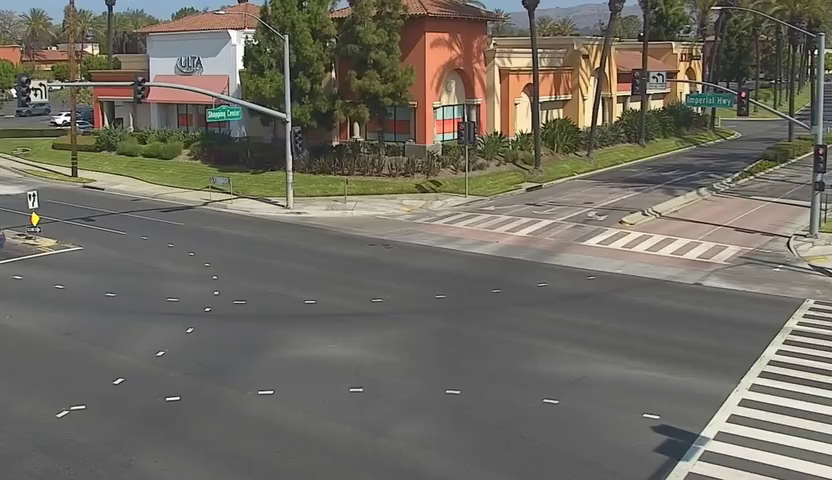

# Part 2.2: Expanding Your Dataset With PAIDF
Part 2.1 left you with a working pipeline and a gap: the verifier misses events
it hasn't seen enough of. Collisions and stalled vehicles are, fortunately,
rare — which is exactly what makes them hard to collect training data for.
The NVIDIA Physical AI Data Factory closes that gap two ways. You can
*generate* an anomaly that never happened from a single camera frame, or you
can *augment* existing footage with new weather and lighting conditions.
This walkthrough does one of each.
```{nvlearning-meta}
- **Level:** All levels — no prior VLM or Cosmos experience needed
- **Tracks:** Two independent tracks, completable in either order
- **Generation time:** About 4 minutes per EVG clip; about 18–20 minutes for the 7-second VDA augmentation plus auto-labeling, once endpoints are ready
- **Working directory:** `/dli/task/Part-2/`
```
## Learning Objectives
```{nvlearning-objectives}
- **Load** and read the two PAIDF local agent skills.
- **Evaluate** a seed image and a sample generation configuration before running a generation job.
- **Generate** a traffic-anomaly video from a single seed frame with Event Video Generation.
- **Augment** an existing clip into new weather and time-of-day conditions with Video Data Augmentation.
- **Verify** generated output against the attribute verification table and the generation config's documented failure modes.
```
This walkthrough has two independent tracks:
| Track | Pipeline | What it produces | Skill used |
|---|---|---|---|
| **A** | Event Video Generation (EVG) | A new traffic-anomaly video (a vehicle accident or a stalled vehicle) from a single camera frame | `physical-ai-event-video-generation-local` |
| **B** | Video Data Augmentation (VDA) | An existing traffic clip augmented for a different weather/time of day, plus auto-labels | `physical-ai-video-data-augmentation-local` |
Do them in either order. Each track follows the same shape:
1. Understand the workflow input
2. Deploy the pipeline's model endpoints
3. Generate or augment one video
4. Review the result and its validation checks
5. Release persistent endpoint containers when they are no longer needed
---
## Load the Skills

Open the Part-2 Directory `cd /dli/task/Part-2/` as its working directory. Its
`skills/` subdirectory already contains both skills this lab uses. 

```
Read skills/physical-ai-event-video-generation-local/SKILL.md and
skills/physical-ai-video-data-augmentation-local/SKILL.md. Confirm you've
read both.
```
---

## Track A — Event Video Generation
### The EVG Seed Frame


EVG begins with a **seed image**: a still image that establishes the scene,
camera viewpoint, objects, and visual context from which the model generates
motion and an event over time. A seed image can come from an existing image
or video frame, or EVG can generate a new seed image when one is not
available.

### Deploy the Model Endpoints
```
Run preflight for physical-ai-event-video-generation-local, then deploy
the model endpoints it needs.
```
Deploys Nemotron 3 Nano Omni (VLM) and Cosmos 3 Nano, or prints hosted
export lines if you ask for `--hosted`. **GPU reality check:** local deploy
needs 2× H100-class GPUs minimum (1 for Cosmos3-Nano, 1 for Nemotron) you 
can set up the workflow with hosted endpoints if needed.

### Generate a Traffic-Anomaly Video
```
Generate one clip of a vehicle stalling in the middle of a busy intersection
using `/dli/task/Part-2/traffic_cam.png` as the seed image, seed 43
```

The skill maps the requested seed image, incident type, environment, and seed
into the road-event configuration, then builds a concrete temporal prompt for
Cosmos I2V. Other supported traffic incidents, such as a vehicle accident,
can be requested by changing the incident in the prompt. Once both endpoints
are ready, expect roughly 4 minutes end to end, dominated
by about 193 seconds of Cosmos I2V inference. Endpoint startup, image pulls,
or an uncached model download add time. Each run produces four files:
```
paidf_outputs/evg/<run-name>/
├── traffic_cam_vehicle_stopped_000.mp4
├── traffic_cam_vehicle_stopped_000_prompt.txt
├── traffic_cam_vehicle_stopped_000_metadata.json
└── traffic_cam_vehicle_stopped_000_evaluation.json
```
### Review the Result
```
Evaluate the result — show me the prompt that was sent to Cosmos I2V and
the verification pass/fail table.
```

Read back the exact prompt Cosmos I2V received and the
`attribute_verification`/evaluation pass-fail table — a VLM-answered check
on whether the requested anomaly actually shows up.

EVG also preserves the outputs it catches as failed instead of presenting
them as successful generations. You can inspect any available video, unchanged
metadata, and `failure_summary.json` under:

```
/dli/task/Part-2/paidf_rejects/evg/<run>/<name>/<attempt>/
```

The single-video flow may use its one configured retry after a failed attempt;
each rejected attempt remains available at this location for comparison.

### Release the EVG Resources

Generation and annotation workers remove themselves when they finish, but
the Nemotron and Cosmos endpoint containers stay up and continue reserving
their GPUs. If you are moving directly to Track B, keep Nemotron running for
reuse and stop only Cosmos. Otherwise, stop both endpoints.

If you are continuing to Track B:

```
Spin down only the EVG `cosmos3-nano` container to release its GPU, and keep
`nemotron-nim` running for VDA. Preserve all images, caches, and outputs.
```

If you are finished with both tracks:

```
Spin down both EVG endpoint containers to release their GPUs. Preserve all
images, caches, and outputs.
```

### See What You Generated

The completed EVG workflow turns the traffic-camera seed frame into this
stalled-vehicle event clip:

<video controls playsinline width="832">
  <source src="./assets/evg_out.mp4" type="video/mp4">
  Your browser cannot play this video inline. <a href="./evg_out.mp4">Open the EVG output directly.</a>
</video>

---
## Track B — Video Data Augmentation
### The VDA Input Video and Augmentation Settings


VDA begins with an **input video** whose scene layout, subjects, and motion
provide the structure for a new version of the clip. The pipeline uses that
source while changing selected visual conditions—such as weather or time of
day so the output remains recognizable as the same scene and activity.

VDA processes video in 93-frame chunks. This walkthrough uses a 93-frame
input—just one chunk—to keep generation time short.

You can view a sample generation config at
`skills/physical-ai-video-data-augmentation-local/assets/cookbooks/city_traffic/workflow_config.yaml`.
It defines one augmentation and weighted default choices for weather and time of day:

```yaml
augmentation:
  n_augmentations: 1
  variables:
    weather:
      clear: 0.35
      overcast: 0.35
      rain: 0.30
    time_of_day:
      morning: 0.25
      midday: 0.25
      evening: 0.25
      night: 0.25
```
The agent uses this sample config as a base, and customizes it from the
user's prompt. Explicitly requesting values such as `clear` and `night`
overrides the weights; otherwise the skill samples from these defaults.
Also review the generation config's relevant failure modes before judging results:
overpass shadows can confuse lighting assessment, and ambiguous signal
states can produce noisy red-light-violation labels. If you use your own
traffic footage, provide its local path instead of the demo clip.

### Deploy the Model Endpoint
```
Run preflight for physical-ai-video-data-augmentation-local, then deploy
the model endpoint it needs.
```
Deploys Nemotron 3 Nano Omni as a single shared VLM+LLM endpoint (needs 1 free GPU), or
reuses the instance Track A already started if you ran that first.
Cosmos Transfer is not a separate endpoint in this flow; the skill loads it
inside the augmentation container when you submit the generation request.
### Augment the Clip With Different Conditions

```
Run only the augmentation stage on `/dli/task/Part-2/input.mp4` using the
`city_traffic` generation config, transforming it into a clear nighttime scene.
```

Then auto-label the result:

```
Auto-label the validated augmented clip from the run you just completed, then
publish the completed run to `paidf_outputs`.
```

Once the endpoint is ready, expect roughly 16 minutes for augmentation and
3 minutes for auto-labeling on this 7-second clip. Around 18–20 minutes
total.

### View the Result

Successful runs are published under
`/dli/task/Part-2/paidf_outputs/vda/<run-name>/<video-name>_aug0/`. View the
generated clip in `augmented/augmented_video.mp4` and the labeled tracking
overlay in `labeled/sidecars/augmented_video_tracking_red_id.mp4`.

```
Show me the generated prompt and metadata from the published VDA run, including
the selected conditions and validation results.
```

The prompt and metadata explain what the model was asked to generate and
whether the result passed its hallucination and attribute checks. 

VDA likewise keeps an augmentation that fails either check out of the successful
output directory while preserving it for inspection. Any available generated
video, unchanged metadata, and `failure_summary.json` are stored under:

```
/dli/task/Part-2/paidf_rejects/vda/<run>/<video>_aug<index>/<attempt>/
```

This lets you see what the pipeline caught and which attribute or structure
check caused the rejection. VDA does not automatically regenerate the failed
clip because its local cookbooks use zero pipeline retries.

As an optional convenience, you can ask the agent to create a browser-ready viewer to see the various generations:

```
Create a self-contained HTML viewer for the published original, augmented,
and labeled videos, using embedded browser-compatible MP4s so they remain visible.
```

### Release the VDA Resources

Augmentation and auto-labeling workers clean themselves up, but the Nemotron
endpoint remains running after the flow and continues to reserve its GPU.

```
Spin down the VDA containers to release their GPUs, including the persistent
`nemotron-nim` endpoint. Preserve all images, caches, run directories, and
published outputs.
```

### See What You Generated

The completed VDA workflow transforms the source traffic footage into this
clear nighttime scene:

<video controls playsinline width="832">
  <source src="./assets/aug_out.mp4" type="video/mp4">
  Your browser cannot play this video inline. <a href="./aug_out.mp4">Open the augmented output directly.</a>
</video>

---
## Scaling Up Generations
This walkthrough runs PAIDF on one machine with local Docker containers,
which is a good fit for small numbers of videos. To generate
larger datasets, **Kubernetes (K8s)** can coordinate containers across a GPU
cluster, while **OSMO** provides a workflow layer for submitting, scheduling,
and monitoring many PAIDF jobs on that shared infrastructure. These scaled
workflows are available from NVIDIA on GitHub: the
[OSMO-based VDA workflow](https://github.com/NVIDIA/physical-ai-data-factory/tree/main/skills/physical-ai-video-data-augmentation)
is part of the [Physical AI Data Factory repository](https://github.com/NVIDIA/physical-ai-data-factory),
and the [Kubernetes/Airflow EVG workflow](https://github.com/NVIDIA/paidf-orchestration/tree/main/skills/physical-ai-event-video-generation)
is part of [PAIDF Orchestration](https://github.com/NVIDIA/paidf-orchestration).
The [OSMO platform](https://github.com/NVIDIA/OSMO) is also open source.
