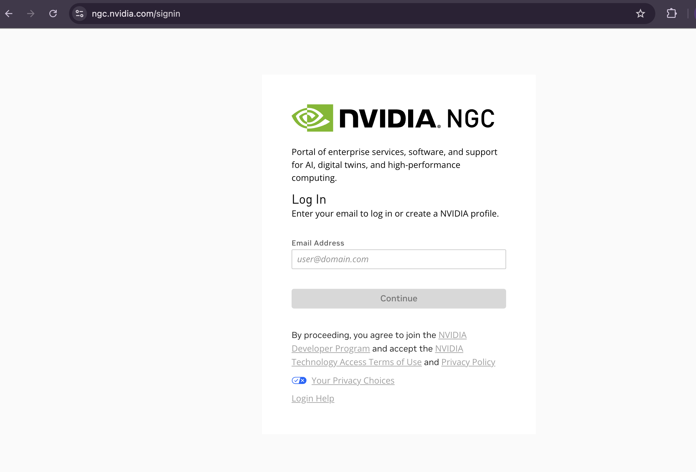
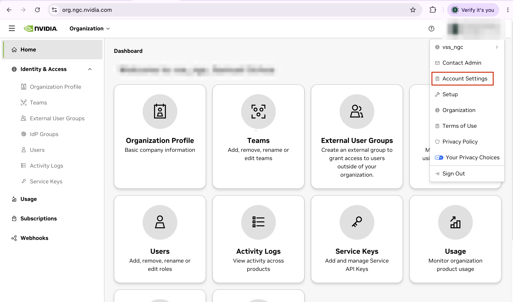
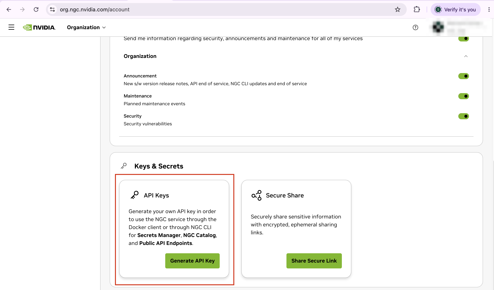
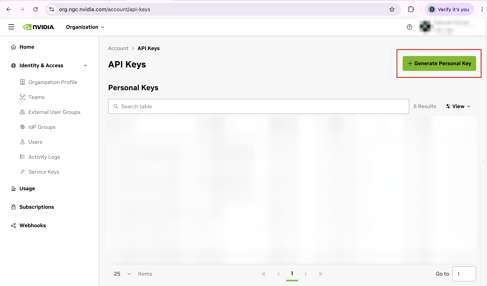
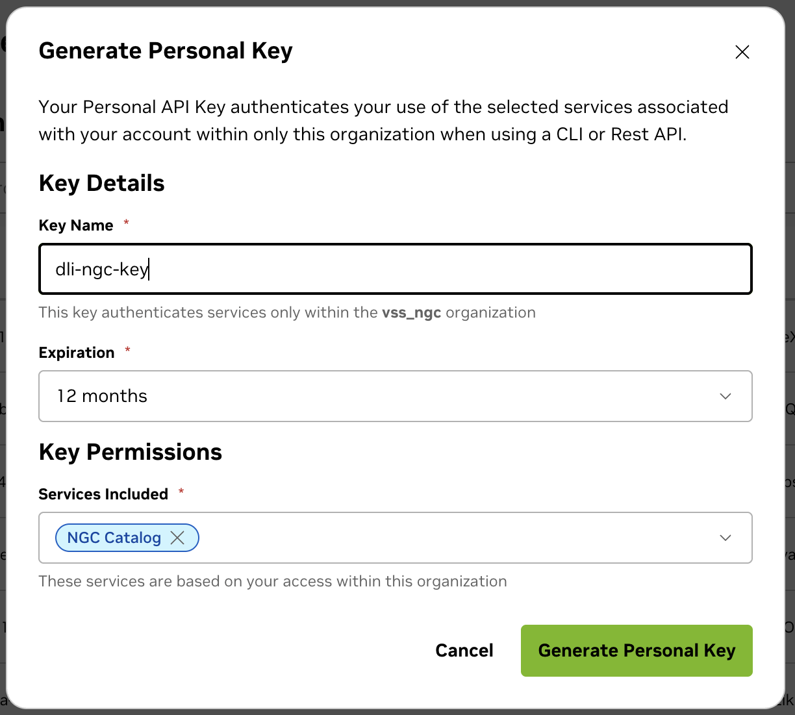

# Prerequisites

A few things need to exist before the course starts, and they involve other
people's systems — an account to create, a key to generate. Do them ahead of
time. None of them are hard, but discovering you need one mid-walkthrough costs
you the walkthrough.

```{nvlearning-meta}
- **Level:** All levels — no prior VLM or Cosmos experience needed
- **When:** Before Part 2.1
- **Time:** About 5 minutes
```

## Learning Objectives

```{nvlearning-objectives}
- **Create** an NVIDIA NGC account and generate a Personal API Key scoped to the NGC Catalog.
- **Store** that key safely, and recognise where the course asks for it.
```

## Create an NGC Personal API Key

Part 2.1 builds the tuned traffic profile, and that build authenticates to
NVIDIA's container registry (`nvcr.io`) to verify the images it uses. That
authentication needs an **NGC Personal API Key** issued to your own account.

:::{important}
Generate this **before** the course. The key is shown exactly once, and the
walkthrough that needs it does not pause while you go and make one.
:::

### 1. Sign in to NGC

Go to [ngc.nvidia.com](https://ngc.nvidia.com) and enter your email address to
log in, or to create an NVIDIA profile if you don't have one yet. Registration
takes a few minutes.



### 2. Open the API Keys page

Click your **username** in the top right corner and select **Account Settings**
from the dropdown.



On that page, scroll down to **Keys & Secrets** and click **Generate API Key**
in the **API Keys** card.



### 3. Generate the key

Click **+ Generate Personal Key** at the top right of the API Keys page.



Fill in the dialog:

1. **Key Name** — something you'll recognise later, such as `dli-ngc-key`.
2. **Expiration** — the default of 12 months is fine; the course needs it for a day.
3. **Key Permissions → Services Included** — select **NGC Catalog**.
4. Click **Generate Personal Key**.



:::{warning}
**Copy the key immediately.** NGC shows it once and will not show it again. Put
it in a password manager or another secure store before you close the dialog.
If you lose it, generate a new one — you cannot recover the old.
:::

It must be a **Personal Key**, not a legacy NGC API key. Personal Keys are
required for Cosmos 3 Reasoner NIM 1.7.0 and later, which is what this course
deploys.

### 4. Know where the course asks for it

You won't need the key until
[Part 2.1](part-2-1-deploy-zero-shot-vss), where one line of the environment
setup reads it in without echoing it to the screen:

```bash
read -rsp 'NGC Personal Key: ' NGC_CLI_API_KEY && echo && export NGC_CLI_API_KEY NGC_API_KEY="$NGC_CLI_API_KEY"
```

Paste it at that prompt. It lives only in that shell for the length of your
session.

:::{danger}
**Never paste your key into a chat with the coding agent, a notebook cell, or a
file.** The agent never needs to see it — by the time it starts, the key is
already exported in the shell it inherits. If the agent asks you for a
credential, the answer is that the key is already set. Do not commit a key to
version control.
:::

```{nvlearning-checkpoint} Before You Start the Course
- You have an NGC account and can sign in at [ngc.nvidia.com](https://ngc.nvidia.com).
- You generated a **Personal API Key** with **NGC Catalog** permissions.
- The key is saved somewhere you can copy it from when Part 2.1 asks.
```

## What's Next

With the prerequisites in place, start with
[Part 1: Cosmos Basics](part-1-cosmos-basics).
